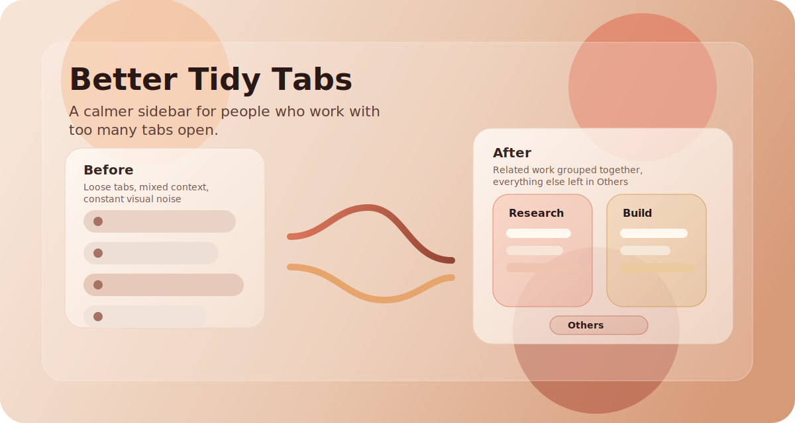

# Better Tidy Tabs

<p align="center">
  
</p>

<p align="center">
  <strong>Turn sidebar chaos into clean task groups.</strong><br/>
  Smarter AI grouping, cloud model choice, faster repeat sorting, and cleaner tab organization for Zen Browser.
</p>

## Why Better Tidy Tabs

`Better Tidy Tabs` is built for people who keep a lot of tabs open and want their Zen sidebar to stay usable.

This fork focuses on one outcome: fewer messy piles of tabs and better task-level grouping with less manual cleanup.

## What This Fork Improves

- **Cloud model choice**
  Pick between Firefox Local AI, Google Gemini, or OpenRouter with your own model name.
- **Task-first grouping**
  Tabs are grouped by what you are actually doing, not by tiny page-title fragments.
- **Fewer bad micro-groups**
  The cloud prompt is tuned to avoid singleton groups and to push leftovers into `Others`.
- **Better reuse of groups you already opened**
  If a current group is the right fit, the sorter can place matching tabs into it instead of starting over.
- **Visible fallback behavior**
  If OpenRouter fails, the mod shows feedback and falls back to Firefox Local AI instead of leaving you guessing.
- **Faster repeat local sorting**
  Cached local embeddings reduce repeated work for Firefox Local AI.
- **Better cloud reliability**
  Gemini fallback handling and OpenRouter request tuning reduce brittle one-shot failures.
- **Advanced Tab Groups icon support**
  AI-created groups can receive matching icons for cleaner visual scanning.

## What It Feels Like

Before:

- mixed research tabs
- random issue pages
- docs, repos, and searches all stacked together

After:

- one broader group for the active coding task
- one group for research or reading
- leftovers pushed into `Others` instead of spawning junk groups

## Install In Zen

Import the repo directly with Sine Mods:

1. Open `Settings` in Zen.
2. Open `Sine Mods`.
3. Click `Import`.
4. Paste:

```text
https://github.com/Reomar/better-tidy-tabs
```

5. Confirm the install.
6. Reload mods or restart Zen if needed.

## Settings

The mod exposes:

- `Enable AI`
- `Sorting Engine`
- `Gemini API Key`
- `OpenRouter API Key`
- `OpenRouter Model Name`

## Engine Options

### Firefox Local AI

- runs on-device
- best when you want zero API cost
- good default for privacy-first sorting

### Google Gemini

- optional cloud provider
- better when you want broader task grouping than local AI usually gives
- falls back to Firefox Local AI if unavailable

### OpenRouter

- optional cloud provider
- bring your own model name
- useful if you want to experiment with different hosted models
- falls back to Firefox Local AI with visible feedback if the request fails

## Best Results

You will usually get the strongest results when:

- the workspace already reflects one or two real workstreams
- tab titles are not all identical boilerplate
- you use a capable cloud model for broad task grouping

## Fork Note

`Better Tidy Tabs` is a fork of [Vertex-Mods/Zen-Tidy-Tabs](https://github.com/Vertex-Mods/Zen-Tidy-Tabs).

Credit goes to the original project and upstream contributors for the Zen sidebar integration, base sorting flow, and the foundation this fork builds on.
